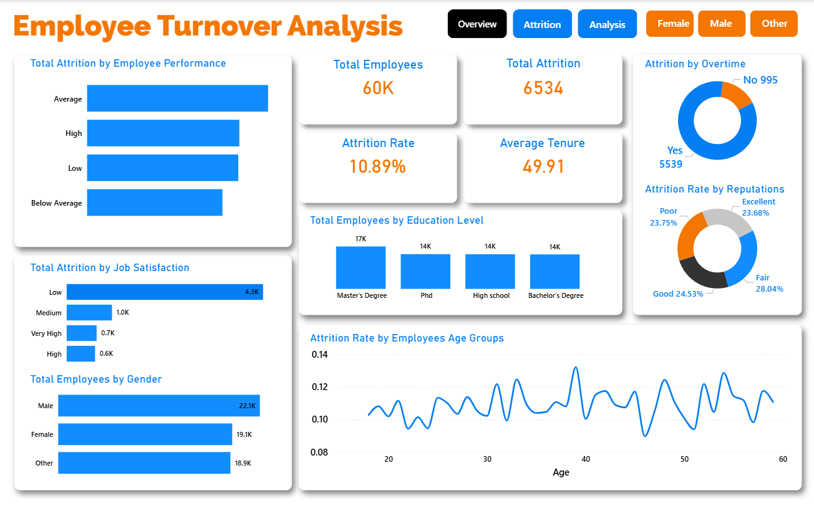
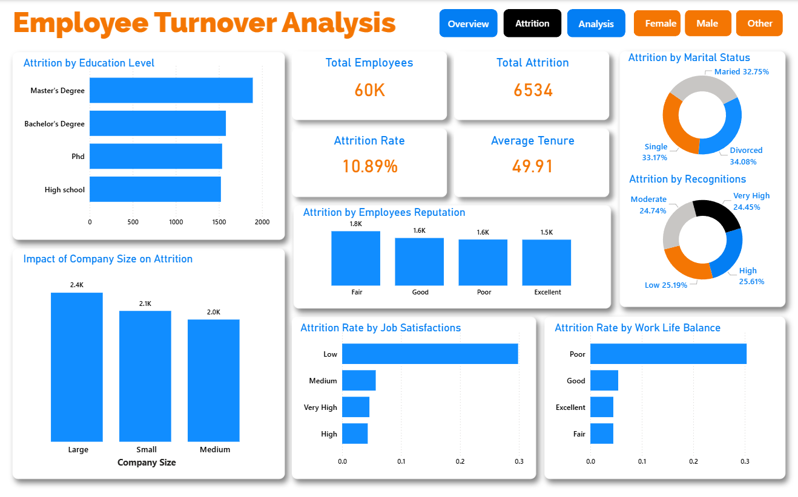
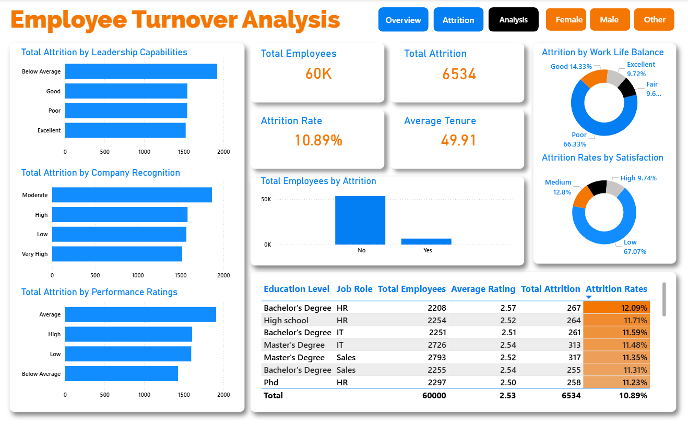

# Employee Turnover Analysis (End-to-End Analysis)

## Executive Summary

### Overview Findings
This project presents an end-to-end analysis of employee attrition using Excel, SQL, Python, and Power BI. It explores how factors such as job satisfaction, leadership, work-life balance, innovation, and overtime influences employee turnover.

Key metrics like attrition rate and category-based risk patterns were analyzed through segmentation and visualization techniques. The project identifies high-risk employee groups and highlights the main drivers of attrition, providing actionable insights to support data-driven retention strategies.

The interactive Power BI dashboard enables us to:
  -  Analysis of employee attrition drivers, including job satisfaction, leadership, work-life balance, innovation, overtime, company reputation, and employee recognition.
  -  Identification of patterns in attrition rates and key factors influencing employee turnover.
  -  Segmentation of employees to highlight high-risk groups prone to attrition.
  -  Development of an interactive dashboard to support data-driven insights into workforce retention and turnover risk.
  -  Comparison of attrition rates across different employee groups to uncover disparities and prioritize targeted retention strategies.

### Data Sources

A synthetically generated employee attrition dataset designed for data analytics and visualization practice, comprising of over 60,000 records. It models key workforce attributes such as demographics, job satisfaction, leadership, work-life balance, innovation, and overtime to support analysis of attrition patterns and underlying drivers of employee turnover.

---

